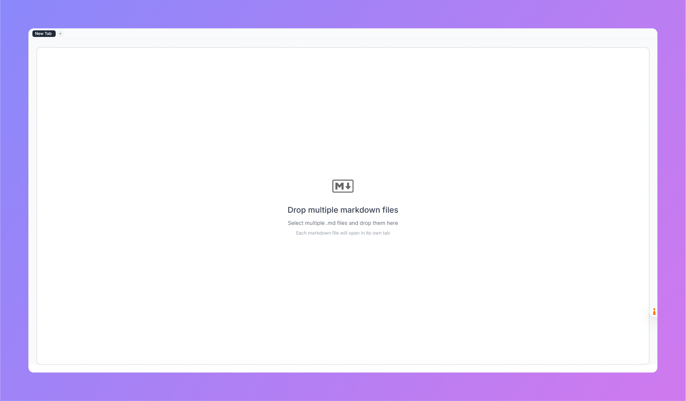

# Minimalist Markdown Viewer

A clean, lightweight, and user-friendly markdown viewer with drag-and-drop functionality. Built with React, TypeScript, and Vite.



## Features

- 🚀 **Drag and Drop** - Simply drag and drop markdown files to view them
- ✨ **Clean Typography** - Beautiful and readable markdown rendering
- 🎨 **Minimalist Design** - Focus on your content without distractions
- ⚡ **Fast & Lightweight** - Built with Vite for optimal performance
- 📱 **Responsive** - Works on both desktop and mobile devices

## Getting Started

### Prerequisites

- Node.js (v16 or later)
- npm or yarn

### Installation

1. Clone the repository:
   ```bash
   git clone https://github.com/yourusername/minimal-markdown-viewer.git
   cd minimal-markdown-viewer
   ```

2. Install dependencies:
   ```bash
   npm install
   # or
   yarn
   ```

### Running Locally

1. Start the development server:
   ```bash
   npm run dev
   # or
   yarn dev
   ```

2. Open your browser and navigate to `http://localhost:5173`

### Building for Production

```bash
npm run build
# or
yarn build
```

## Usage

1. Open the application in your browser
2. Drag and drop a markdown (.md) file anywhere on the page
3. View your beautifully rendered markdown
4. To load a new file, simply drag and drop another file

## Technologies Used

- [React](https://reactjs.org/) - JavaScript library for building user interfaces
- [TypeScript](https://www.typescriptlang.org/) - Type-safe JavaScript
- [Vite](https://vitejs.dev/) - Next Generation Frontend Tooling
- [Marked](https://marked.js.org/) - A markdown parser and compiler
- [Lucide React](https://lucide.dev/) - Beautiful & consistent icons

## License

This project is licensed under the MIT License - see the [LICENSE](LICENSE) file for details.

## Contributing

Contributions are welcome! Please feel free to submit a Pull Request.

## Acknowledgments

- [Google Fonts](https://fonts.google.com/) for the Inter font family
- [Vite](https://vitejs.dev/) for the amazing development experience
